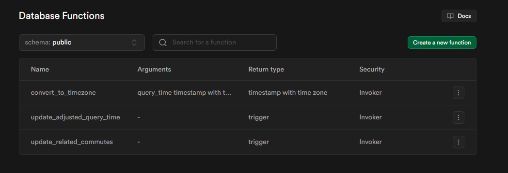

# OptimizeRouteApp

### Utilizing the Tool

1. Create a project on supabase or wherever you want to create your own postgresql database

2. Install schema onto the database:
```psql --host=<host> --port=<port> --username=<username> --dbname=<database_name> --file=supabase/database_setup.sql```

The ERD should look like this:


The following functions should be in the database


The following triggers should be in the database


3. Run ```make all``` to build the binaries for the lambda functions.

4. Create a google API key and setup cloud resources as outlined in section [Deploying to AWS](#deploying-to-aws). In supabase, to find the variables needed refer to your projects settings/database and settings/api. 

5. Add users to the database. Currently this has to be performed manually.

6. You can either manaully enter a users route in the table or run: ```./dist/addUserRoute/bootstrap ```. The SUPABASE_URL, SUPABASE_KEY, and GOOGLE_API_KEY need to be set in your environment variables. These can be found on your supabase projects supabase/api page or from google cloud.

7. Once enough data is stored in your database, make use of the evidence.dev dashboard and connect the dashboard with your postgres database. More information can be found in the [dashboard README](./dashboards/README.md).

### Building and testing in Local:

Build binary and zip
```
make all
```

Testing in Local For the OptimizeRouteFunction:
```
sam local invoke OptimizeRouteFunction --event event.json
```

Example event.json
```
{
  "user_id": 1,
  "route": 1,
  "to_work": true,
  "timezone": "US/Mountain",
  "origin": {
    "latitude": START_LATITUDE,
    "longitude": START_LONGITUDE
  },
  "destination": {
    "latitude": STOP_LATITUDE,
    "longitude": STOP_LONGITUDE
  }
}
```

Example template.yaml for sam cli:
```
AWSTemplateFormatVersion: '2010-09-09'
Transform: 'AWS::Serverless-2016-10-31'

Resources:
  OptimizeRouteFunction:
    Type: 'AWS::Serverless::Function'
    Properties:
      Handler: optimizeRoute
      Runtime: provided.al2023
      CodeUri: ./dist/optimizeRoute/optimizeRoute.zip
      Timeout: 10  
      MemorySize: 128
      Description: 'A Lambda function to calculate the commute distance and time'  
      Environment:
        Variables:
          GOOGLE_API_KEY: "YOUR_API_KEY"
          SUPABASE_URL: "YOUR_DATABASE_URL"
          SUPABASE_KEY: "YOUR_DATABASE_SECRET"

  CommutesQueueFunction:
    Type: 'AWS::Serverless::Function'
    Properties:
      Handler: commutesQueue
      Runtime: provided.al2023
      CodeUri: ./dist/commutesQueue/commutesQueue.zip
      Timeout: 10  
      MemorySize: 128
      Description: 'A Lambda function to find the routes to send API requests'  
      Environment:
        Variables:
          SUPABASE_URL: "YOUR_DATABASE_URL"
          SUPABASE_KEY: "YOUR_DATABASE_SECRET"
          OPTIMIZE_ROUTE_FUNCTION: "YOUR_OPTIMIZE_ROUTE_FUNCTION_ARN"
```

### Deploying to AWS

Refer to the files located in ./terraform, specifically ./terraform/variables.tf for the variables required to run  ```terraform apply```

Note: You will need a GCP API key for the "https://routes.googleapis.com/directions/v2:computeRoutes" API endpoint.

The Cloudwatch CRON job will immediately start called the commutesQueue Lambda function. This lambda function requires a valid and active route to be in the routes table in the postgres table.

### Viewing Results via Evidence.dev
Open the project in the dashboards subdirectory and make sure to run the evidence.dev code via vscode or whatever way you prefer. Refer to: https://docs.evidence.dev/install-evidence/ for more information.